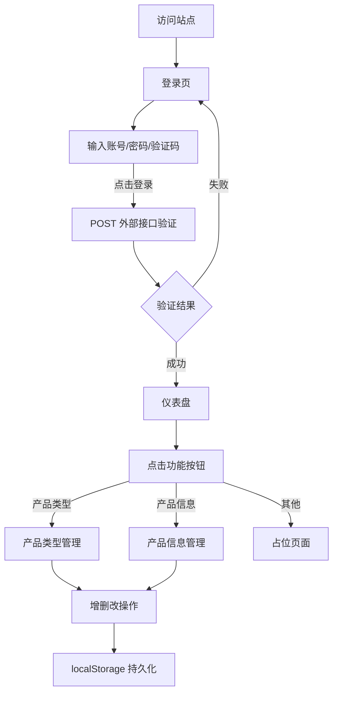

# 电脑产品出入库管理系统 PRD

## 1. 产品概述
一款面向仓库/IT 资产管理的电脑产品出入库 SPA 系统，提供登录验证、数据看板、产品类型与信息管理等功能，以高颜值界面提升日常出入库作业效率与体验。
- 解决问题：将传统表格式出入库管理升级为现代化、可视化的工作台
- 目标用户：仓库管理员、IT 资产管理人员
- 价值：提升操作效率、降低出错率、增强数据可读性

## 2. 核心功能

### 2.1 用户角色
| 角色 | 注册方式 | 核心权限 |
|------|----------|----------|
| 管理员 | 外部账号体系（ytgdxt.com） | 登录、查看统计、管理产品类型与信息、出入库操作 |

### 2.2 功能模块
1. **登录页**：账号、密码、验证码输入，点击登录调用外部接口验证身份
2. **仪表盘**：六个功能入口按钮 + 今日/本月出入库统计卡片
3. **产品类型管理**：表格展示类型列表，支持增删改，底部显示数量合计
4. **产品信息管理**：表格展示产品列表，类型字段联动产品类型（可搜索下拉）
5. **入库/出库/清单页**：占位页面（本期暂不实现，后续迭代）

### 2.3 页面详情
| 页面名称 | 模块名称 | 功能描述 |
|----------|----------|----------|
| 登录页 | 账号输入框 | 输入登录账号 |
| 登录页 | 密码输入框 | 输入登录密码，支持显示/隐藏切换 |
| 登录页 | 验证码图片 + 输入框 | 从外部接口获取验证码图片并输入，点击图片可刷新 |
| 登录页 | 登录按钮 | 提交表单，POST 外部接口验证，带验证码 cookie |
| 仪表盘 | 统计卡片区 | 今日入库、今日出库、本月入库、本月出库 |
| 仪表盘 | 功能按钮区 | 产品类型、产品信息、入库、入库清单、出库、出库清单 |
| 仪表盘 | 顶部导航 | Logo + 用户名 + 退出登录 |
| 产品类型 | 添加按钮 | 顶部按钮，弹出添加表单（模态框） |
| 产品类型 | 数据表格 | 列：ID、产品类型、添加时间、功能（删除/修改） |
| 产品类型 | 数量合计 | 底部粘性栏显示总条数 |
| 产品类型 | 搜索框 | 顶部搜索框，按类型名称过滤 |
| 产品信息 | 添加按钮 | 顶部按钮，弹出添加表单（模态框） |
| 产品信息 | 数据表格 | 列：ID、类型（联动可搜索下拉）、产品名称、保修期限、添加时间、功能（删除/修改） |
| 产品信息 | 搜索框 | 顶部搜索框，按产品名称/类型过滤 |

## 3. 核心流程

**登录流程**：用户输入账号密码验证码 → 点击登录 → 前端将验证码请求时保存的 cookie 一并提交 → POST 到外部接口 → 判断响应 → 成功则跳转仪表盘，失败则提示错误并刷新验证码

**页面跳转流程**：仪表盘点击功能按钮 → hash 路由切换 → 渲染对应第三级页面 → 操作（增删改）→ 数据持久化到 localStorage → 刷新表格

## 4. 用户界面设计

### 4.1 设计风格
- **主题方向**：Neo-Tech Noir（新科技暗黑）— 深色背景搭配电光青蓝与暖琥珀双色强调，营造高端工业科技感
- **主色调**：深石板色（#0A0E1A / #111827）背景，电光青蓝（#22D3EE）为主强调色，暖琥珀（#F59E0B）为次强调色，翡翠绿（#10B981）用于入库正向，玫红（#F43F5E）用于出库/删除
- **字体方案**：
  - 显示字体：Syne（标题/品牌）
  - 正文字体：Manrope（界面文字）
  - 等宽字体：JetBrains Mono（数据/编号/时间）
- **按钮风格**：玻璃拟态 + 微发光边框，hover 时辉光增强，主按钮带渐变
- **布局风格**：卡片式 + 网格布局，仪表盘采用错落式统计卡 + 网格功能按钮
- **图标风格**：Lucide 线性图标，与整体线性科技感统一
- **氛围细节**：背景网格纹理、径向渐变光晕、噪点叠层、卡片悬浮微动效、数字滚动动画

### 4.2 页面设计概览
| 页面名称 | 模块名称 | UI 元素 |
|----------|----------|----------|
| 登录页 | 中央卡片 | 玻璃拟态卡片，左侧品牌区（Logo + 标语 + 装饰图形），右侧表单，背景径向光晕 + 网格 |
| 仪表盘 | 顶部导航 | Logo + 面包屑 + 用户信息 + 退出按钮 |
| 仪表盘 | 统计卡片区 | 4 个错落式卡片，每张含图标、数值（数字滚动）、标签、趋势条/迷你图 |
| 仪表盘 | 功能按钮网格 | 6 个大按钮卡片，hover 发光位移，点击跳转 |
| 产品类型 | 工具栏 | 标题 + 描述 + 添加按钮 + 搜索框 |
| 产品类型 | 表格 | 等宽字体 ID、玻璃行、hover 高亮、操作图标按钮 |
| 产品类型 | 底部合计 | 粘性底栏显示总条数 |
| 产品信息 | 工具栏 | 标题 + 描述 + 添加按钮 + 搜索框 |
| 产品信息 | 表格 | 类型列为可搜索下拉，联动产品类型数据 |
| 占位页 | 居中卡片 | 图标 + "建设中"文案 + 返回按钮 |

### 4.3 响应式
- 桌面优先（1280px+ 完整体验）
- 平板自适应（768-1280px 布局收缩，统计卡 2 列）
- 移动端基本可用（触控优化，表格横向滚动，导航折叠）
