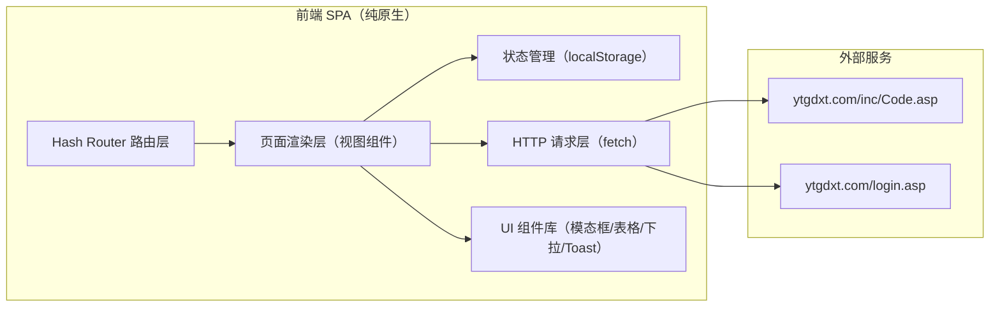
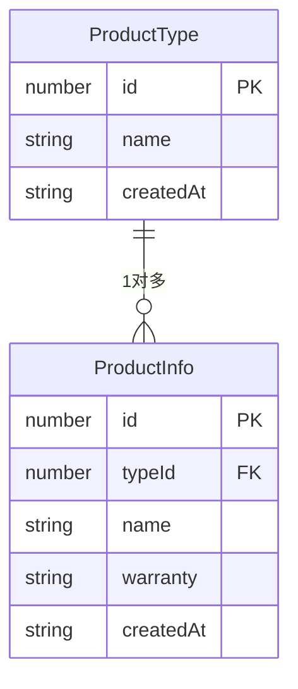

# 技术架构文档

## 1. 架构设计



## 2. 技术栈
- **前端**：纯原生 HTML5 + CSS3 + JavaScript (ES6+)，无构建步骤，无框架依赖
- **路由**：Hash 路由（#/login、#/dashboard、#/product-types ...）
- **状态持久化**：localStorage（登录态、产品类型、产品信息数据）
- **图标**：Lucide Icons（CDN，linear 风格）
- **字体**：Google Fonts（Syne / Manrope / JetBrains Mono）
- **后端**：无（纯前端项目，登录调用外部接口）
- **数据**：内置 Mock 种子数据 + localStorage 持久化
- **文件结构**：
  - `index.html` — 单页应用入口，包含所有页面容器
  - `styles/main.css` — 全局样式与设计 token
  - `styles/components.css` — 组件样式（表格/模态框/卡片等）
  - `js/router.js` — Hash 路由器
  - `js/store.js` — 数据存储与 localStorage 封装
  - `js/api.js` — 外部接口请求（登录/验证码）
  - `js/pages/login.js` — 登录页
  - `js/pages/dashboard.js` — 仪表盘
  - `js/pages/productTypes.js` — 产品类型管理
  - `js/pages/productInfo.js` — 产品信息管理
  - `js/pages/placeholder.js` — 占位页（入库/出库/清单）
  - `js/components/*.js` — 通用组件（Modal、Combobox、Toast）
  - `js/app.js` — 应用入口，初始化路由

## 3. 路由定义
| 路由 | 用途 |
|------|------|
| #/login | 登录页（默认重定向） |
| #/dashboard | 仪表盘 |
| #/product-types | 产品类型管理 |
| #/product-info | 产品信息管理 |
| #/inbound | 入库（占位） |
| #/inbound-list | 入库清单（占位） |
| #/outbound | 出库（占位） |
| #/outbound-list | 出库清单（占位） |

## 4. API 定义

### 4.1 外部接口（登录）
```typescript
// 获取验证码图片（带 cookie）
GET http://www.ytgdxt.com/inc/Code.asp
Response: image/gif
Set-Cookie: ASPSESSIONIDxxx=...  // 需保存并在登录时回传

// 登录验证
POST http://www.ytgdxt.com/login.asp
Content-Type: application/x-www-form-urlencoded
Cookie: <验证码请求返回的 cookie>
Body: admin={账号}&pass={密码}&code={验证码}&send=ok&x=70&y=9
Response: HTML（根据响应内容判断是否登录成功）
```

### 4.2 CORS 说明与降级策略
浏览器同源策略会阻断 SPA 直接请求外部接口。本期实现策略：
1. **真实请求**：使用 `fetch(url, { credentials: 'include' })`，验证码图片用 `` 标签直接加载（天然支持跨域与 cookie）
2. **CORS 降级**：登录 POST 若被 CORS 阻断，捕获异常后回退到 Mock 登录（账号 `admin` / 密码 `123456` / 验证码任意），保证 UI 可演示
3. **生产建议**：真实部署需加后端代理（Node/Express 转发请求到 ytgdxt.com）

### 4.3 验证码图片处理
- 用 `` 加载
- 浏览器会自动保存 cookie，登录 POST 时浏览器自动携带（同源策略下需 `credentials: 'include'`）
- 点击图片刷新：更新 timestamp 参数重新加载

## 5. 数据模型

### 5.1 数据模型定义



### 5.2 数据定义（localStorage 结构）
```javascript
// localStorage keys
'inventory_session'    // { loggedIn: bool, user: string, loginAt: ts }
'inventory_types'      // ProductType[]
'inventory_products'   // ProductInfo[]
'inventory_inbound'    // InboundRecord[]  (预留)
'inventory_outbound'   // OutboundRecord[] (预留)

// 初始化种子数据
ProductType = [
  { id: 1, name: '笔记本电脑', createdAt: '2026-06-15 10:30' },
  { id: 2, name: '台式主机',   createdAt: '2026-06-16 14:20' },
  { id: 3, name: '显示器',     createdAt: '2026-06-18 09:15' },
  { id: 4, name: '键鼠套装',   createdAt: '2026-06-20 16:45' },
  { id: 5, name: '打印机',     createdAt: '2026-06-22 11:00' },
]
ProductInfo = [
  { id: 1, typeId: 1, name: 'ThinkPad X1 Carbon Gen11', warranty: '36个月', createdAt: '2026-06-15 10:35' },
  { id: 2, typeId: 1, name: 'MacBook Pro 14 M3',        warranty: '12个月', createdAt: '2026-06-15 11:00' },
  { id: 3, typeId: 2, name: 'Dell OptiPlex 7010',       warranty: '36个月', createdAt: '2026-06-16 14:30' },
  { id: 4, typeId: 3, name: 'Dell U2723QE 27寸 4K',     warranty: '36个月', createdAt: '2026-06-18 09:20' },
  { id: 5, typeId: 4, name: 'Logitech MX Keys S',       warranty: '12个月', createdAt: '2026-06-20 16:50' },
]
```

### 5.3 统计数据（仪表盘）
今日/月度出入库数量从 `inventory_inbound` / `inventory_outbound` 按日期聚合计算；本期这两张表暂未实现 CRUD，仪表盘统计区使用 Mock 数值展示（带数字滚动动画）。
